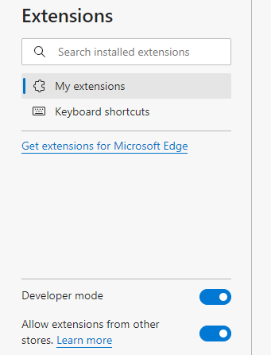

# PowerShell Script Executor Extension

PowerShell Script Executor Extension is a Microsoft Edge extension
designed to run local PowerShell scripts on Windows. It utilizes a
Python script as the NativeMessagingHost, enabling seamless
communication with the background thread of the extension. Currently,
the extension can read the URL from an active tab and pass this
information to the PowerShell script for further processing.

## Usage

1.  Type edge://extensions/ in Edge’s address bar.

2.  Turn on “Developer mode” and “Allow extensions from other stores “on
    the left side of the page.

>  style="width:3.55258in;height:4.64648in"
> alt="A screenshot of a computer Description automatically generated" />

3.  Click Load unpacked on the top right of the page and select the
    project main directory.

4.  Find PowerShell Executor card and grab the ID

>  alt="A white rectangular object with a black border Description automatically generated" />

5.  Run setup.bat as an administrator.This will prompt you to enter the
    extension ID and then set up the NativeMessagingHost accordingly.

6.  Now you should be able to see the extension installed as

>  style="width:4.1985in;height:2.51077in"
> alt="A screenshot of a computer program Description automatically generated" />

7.  Enter the absolute path of the PowerShell Script. As a default
    example, enter

    "C:
    Path\To\Project\Powershell-Script-Executor-Extention\powerShellScripts\\
    download_video.ps1 "

> When executed, this should download the video from the current tab
> using yt-dlp.exe.

## PowerShell Script

> An example can be found at "C:
> Path\To\Project\Powershell-Script-Executor-Extention\powerShellScripts\\
> download_video.ps1 " Note that the script accepts a single parameter,
> url, which corresponds to the URL of the tab where the user clicked
> the "Execute" button.url which is the tab’s url.
